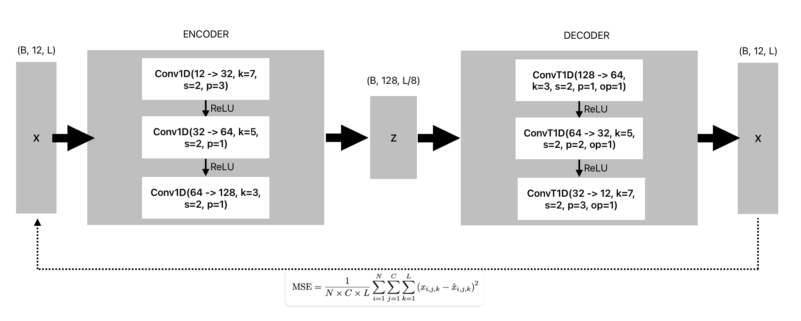
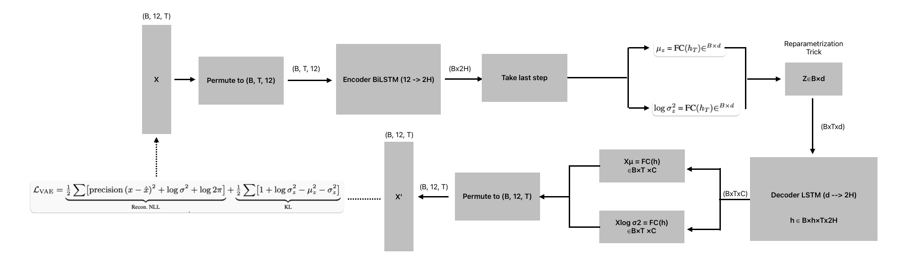
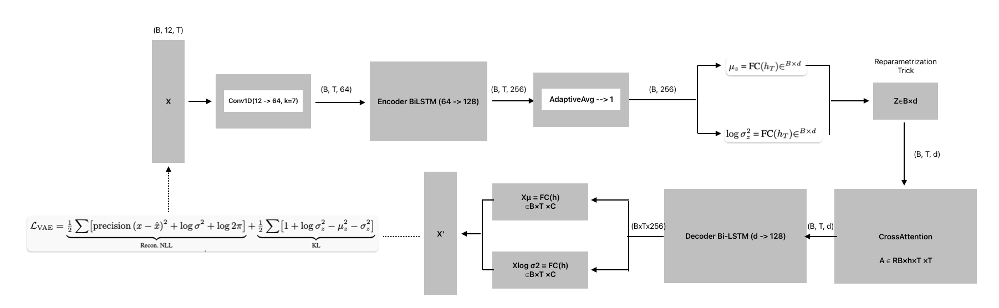
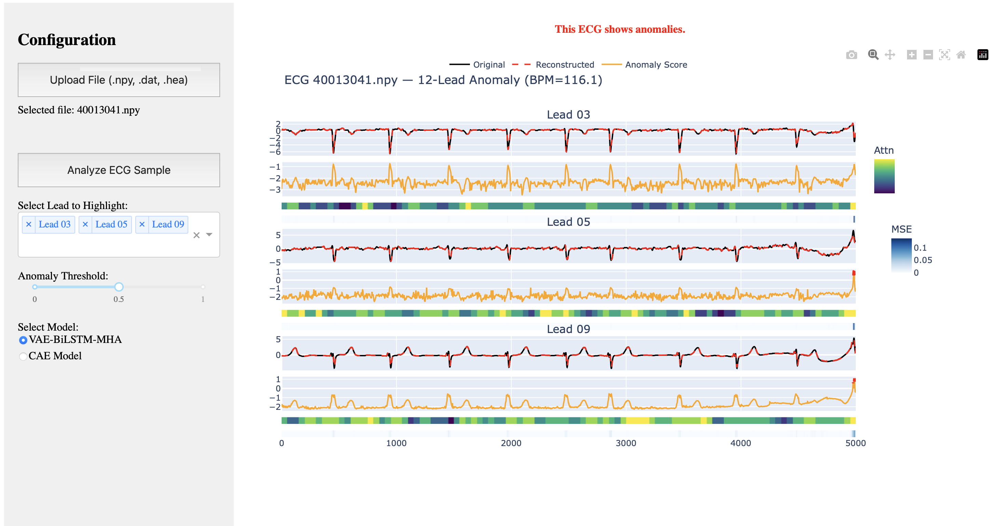
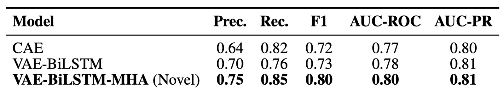

# 12-Lead ECG Anomaly Detection

## About

This project focuses on the **unsupervised detection of anomalies in 12-lead electrocardiograms (ECGs)** autoencoder-based architectures. It explores and compares three models:

- **Convolutional Autoencoder (CAE)**  
- **Variational Autoencoder (VAE)**  
- **Variational Autoencoder with Multi-Head Attention (VAE-MHA)**  

In addition to modeling, the project also includes an interactive **dashboard** designed for **interpretable visualization** of the results. This web application allows users to analyze ECG signals and interpret possible anomalous patterns within a user-friendly environment.

---

## Academic context

This code accompanies my **Final Degree Project in Artificial Intelligence** (Universitat Autònoma de Barcelona, Escola d’Enginyeria).

* **Author:** Marc Garreta Basora  
* **Supervisor:** Dr. Mehmet Oguz Mulayim – [@omulayim](https://github.com/omulayim)  
* **Report:** see `/docs/final_report.pdf` for a full technical write-up.

---

## Model Architectures

### CAE
A lightweight convolutional autoencoder that detects anomalies via reconstruction error on raw ECG signals. The architecture is inspired from the convolutional structure presented by Zhang et al. [1].



### VAE-BiLSTM
A bidirectional LSTM-based variational autoencoder that captures global ECG deviations without attention mechanisms. This model is primarily inspired by the anomaly detection approach (OmniAnomaly) of Fu et al. [3], with theoretical foundations based on the variational inference concepts introduced by Kingma and Welling [2].



### VAE-BiLSTM-MHA
A variational autoencoder enhanced with both lead-wise and temporal multi-head attention for highlighting when and where anomalies occur. This novel approach is inspired by the architecture proposed by Correia et al. [4], which applies a similar structure for anomaly detection in multivariate time-series data, although in a different data domain than ECG signals.



---

## Dashboard
This user-friendly web application allow users to:

- Upload ECG signals in standard formats (`.npy` or `.dat/.hea`).
- Select between different models for analysis:
  - **Convolutional Autoencoder (CAE)**
  - **VAE-BiLSTM-MHA** 
- Visualize the full 12-lead ECG with anomaly detection results.
- Adjust configuration options, such as:
  - Choosing specific leads to visualize.
  - Modifying the anomaly threshold *(not recommended, as it is precomputed during model validation)*.

For each lead, the interface provides:

- The original signal (black) vs. reconstructed signal (red).
- The anomaly score (orange).
- A lead-wise attention heat-map
- A point-wise reconstruction error (MSE) color bar.

This setup enables users to not only detect anomalies but also interpret when and where they occur within the ECG signal.



---

## Results


---

## Data sources

Before you begin, download the ECG datasets in case of training:

- **MIMIC-IV ECG (restricted)**
  - URL: https://physionet.org/content/mimic-iv-ecg/1.0/
  - Access requires an authenticated PhysioNet account and approval to the MIMIC project.

- **PTB-XL (open)**
  - URL: https://physionet.org/content/ptb-xl/1.0.3/
 
---

## Quick start

```bash
# clone repo
git clone https://github.com/marcgarreta/12-lead-ECG-AD
cd 12-lead-ECG-AD

# create & activate environment
conda env create -f environment.yml
conda activate ecg-anomaly-detection

# pre-process mimic data -- data will be stored in /data/processed/mimic/
cd src/data_processing
python pre-process.py --dataset mimic --input-dir {path_of_mimic-iv-ecg-diagnostic-electrocardiogram-matched-subset-1.0} --clean-nans

# pre-process ptbxl data -- data will be stored in /data/processed/ptbxl/
cd src/data_processing
python pre-process.py --dataset ptbxl --input-dir {path_of_ptb-xl-a-large-publicly-available-electrocardiography-dataset-1.0.3}

# training
cd src
python training.py --dataset [ptbxl or mimic or both]

# visualization (to visualize defined samples from the test set)
python visualization_cae.py #if you want to plot the cae visualizations
python visualization_vae.py #if you want to plot the vae visualizations

# ui (to run the local web application)
cd ui
python app.py 
``` 

---

## References

1. T. Zhang, Y. Zhang, B. Zhang, H. Zhou, Q. Xu, Y. Zhang, and C. Xu, *Unsupervised Deep Anomaly Detection for Multi-Sensor Time-Series Signals*, arXiv preprint arXiv:2107.12626, 2021. [Online]. Available: [https://arxiv.org/abs/2107.12626](https://arxiv.org/abs/2107.12626)

2. D. P. Kingma and M. Welling, *Auto-encoding variational Bayes*, arXiv preprint arXiv:1312.6114, 2013. [Online]. Available: [https://arxiv.org/abs/1312.6114](https://arxiv.org/abs/1312.6114)

3. C. Fu, D. Zhang, P. Huang, S. Liu, Y. Qiao, and H. Xu, *Robust Anomaly Detection for Multivariate Time Series via Generative Adversarial Networks*, in *Proceedings of the 25th ACM SIGKDD International Conference on Knowledge Discovery & Data Mining (KDD '19)*, 2019, pp. 2828–2837.

4. L. Correia, J.-C. Goos, P. Klein, T. Bäck, and A. V. Kononova, *MA-VAE: Multi-head Attention-based Variational Autoencoder for Anomaly Detection in Multivariate Time Series*, arXiv preprint arXiv:2309.02253, 2023. [Online]. Available: [https://arxiv.org/abs/2309.02253](https://arxiv.org/abs/2309.02253)

---