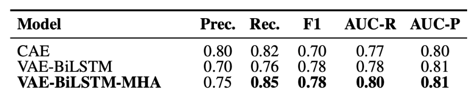

# 12-Lead ECG Anomaly Detection

Unsupervised detection of anomalies in 12-lead electrocardiograms (ECGs) using three autoencoder-based models (Convolutional Autoencoder, Variational Autoencoder, Variational Autoencoder with Multi-Head Attention) plus an interactive Dash dashboard for interpretable results.

---

## Academic context

This code accompanies my **Final Degree Project in Artificial Intelligence** (Universitat Autònoma de Barcelona, Escola d’Enginyeria).

* **Author:** Marc Garreta Basora  
* **Supervisor:** Dr. Mehmet Oguz Mulayim – [@omulayim](https://github.com/omulayim)  
* **Report:** see `/docs/final_report.pdf` for a full technical write-up.

---

## Models

CAE: A lightweight convolutional autoencoder that flags anomalies purely via reconstruction error on raw ECG waveforms


VAE-BiLSTM: A bidirectional LSTM VAE that captures global ECG deviations without any attention mechanisms.

A bidirectional LSTM VAE that captures global ECG deviations without any attention mechanisms.

VAE-BiLSTM-MHA: A variational autoencoder with both lead-wise and temporal multi-head attention for pinpointing when and where anomalies occur (Novel approach) 


---

## Dashboard


---

## Results


---

## Data sources

Before you begin, download the ECG datasets in case of training:

- **MIMIC-IV ECG (restricted)**
  - URL: https://physionet.org/content/mimic-iv-ecg/1.0/
  - Access requires an authenticated PhysioNet account and approval to the MIMIC project.

- **PTB-XL (open)**
  - URL: https://physionet.org/content/ptb-xl/1.0.3/
 
---

## Quick start

```bash
# clone repo
git clone https://github.com/marcgarreta/12-lead-ECG-AD
cd 12-lead-ECG-AD

# create & activate environment
conda env create -f environment.yml
conda activate ecg-anomaly-detection

# pre-process mimic data -- data will be stored in /data/processed/mimic/
cd src/data_processing
python pre-process.py --dataset mimic --input-dir {path_of_mimic-iv-ecg-diagnostic-electrocardiogram-matched-subset-1.0} --clean-nans

# pre-process ptbxl data -- data will be stored in /data/processed/ptbxl/
cd src/data_processing
python pre-process.py --dataset ptbxl --input-dir {path_of_ptb-xl-a-large-publicly-available-electrocardiography-dataset-1.0.3}

# training
cd src
python training.py --dataset [ptbxl or mimic or both]

# visualization (to visualize defined samples from the test set)
python visualization_cae.py #if you want to plot the cae visualizations
python visualization_vae.py #if you want to plot the vae visualizations

# ui (to run the local web application)
src ui
python app.py 
´´´
---

##REFERENCES
